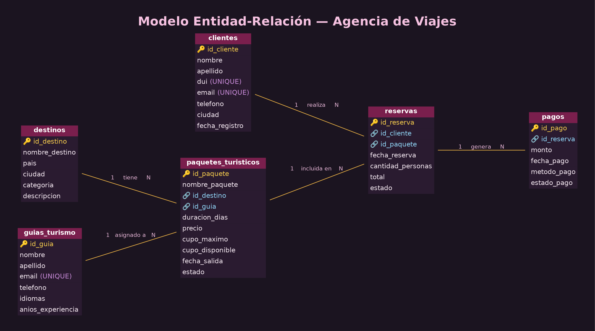

#  Sistema de Base de Datos — Agencia de Viajes

**Estudiante:** Nicole Angelina Beltrán Ramírez
**Propuesta elegida:** N° 3 — Agencia de Viajes

Proyecto de base de datos relacional para la gestión de una **Agencia de Viajes**, desarrollado en **MySQL**. El sistema administra clientes, destinos turísticos, paquetes, guías de turismo, reservas y pagos, aplicando normalización, integridad referencial y consultas SQL avanzadas.

---

##  Descripción del proyecto

La agencia necesita controlar de forma ordenada:

- Los **clientes** que contratan viajes.
- Los **destinos** turísticos disponibles.
- Los **guías de turismo** asignados a cada paquete.
- Los **paquetes turísticos** ofrecidos (precio, cupos, fechas).
- Las **reservas** que hacen los clientes sobre esos paquetes.
- Los **pagos** asociados a cada reserva.

Este repositorio contiene el modelo de datos, los scripts SQL y la documentación necesaria para desplegar la base de datos completa.

---

##  Estructura del repositorio

| N° | Archivo | Contenido |
|----|----------|-----------|
| 1 | `01_script_creacion.sql` | Sentencias `CREATE TABLE` con todas sus restricciones. |
| 2 | `02_script_insercion.sql` | `INSERT INTO` con al menos 10 registros por tabla. |
| 3 | `03_consultas.sql` | Las 20 consultas solicitadas con comentarios identificadores. |
| 4 | `04_usuarios.sql` | Scripts para crear los usuarios `admin` y `docente` con sus permisos. |
| 5 | `backup_agencia-viajes_nicole-beltran.sql` | Backup completo de la base de datos en formato SQL. |
| 6 | `README.md` | Documentación completa del proyecto. |

---

##  Modelo Entidad-Relación

**Entidades principales:**

- `clientes` — Entidad Principal 1
- `paquetes_turisticos` — Entidad Principal 2
- `reservas` — Transacción (vincula cliente y paquete)
- `pagos` — Pago/Movimiento (asociado a una reserva)

**Entidades de apoyo (catálogos):**

- `destinos`
- `guias_turismo`

### Diagrama Entidad-Relación (imagen exportada)



### Diagrama Entidad-Relación (representación textual)

```
 clientes                     paquetes_turisticos                  destinos
+---------------+           +------------------------+          +------------------+
| id_cliente PK |           | id_paquete PK          |          | id_destino PK    |
| nombre        |           | nombre_paquete         |   N:1    | nombre_destino   |
| apellido      |           | id_destino FK  --------|--------->| pais             |
| dui           |           | id_guia FK     --------|----+     | ciudad           |
| email         |           | duracion_dias          |    |     | categoria        |
| telefono      |           | precio                 |    |     | descripcion      |
| ciudad        |           | cupo_maximo            |    |     +------------------+
| fecha_registro|           | cupo_disponible        |    |
+-------+-------+           | fecha_salida           |    |     guias_turismo
        | 1                 | estado                 |    |    +------------------+
        |                   +-----------+------------+    +--->| id_guia PK       |
        | N                             | 1                    | nombre           |
+-------v-------+                       | N                    | apellido         |
|   reservas    +<----------------------+                      | email            |
| id_reserva PK |                                               | telefono        |
| id_cliente FK |                                               | idiomas         |
| id_paquete FK |                                               | anios_experiencia|
| fecha_reserva |                                               +------------------+
| cantidad_pers.|
| total         |
| estado        |
+-------+-------+
        | 1
        |
        | N
+-------v-------+
|     pagos     |
| id_pago PK    |
| id_reserva FK |
| monto         |
| fecha_pago    |
| metodo_pago   |
| estado_pago   |
+---------------+
```

### Cardinalidades

| Relación | Cardinalidad |
|----------|--------------|
| `clientes` → `reservas` | 1 a N |
| `paquetes_turisticos` → `reservas` | 1 a N |
| `destinos` → `paquetes_turisticos` | 1 a N |
| `guias_turismo` → `paquetes_turisticos` | 1 a N |
| `reservas` → `pagos` | 1 a N |

---

##  Normalización de la base de datos

El modelo cumple con las tres primeras formas normales:

**1FN (Primera Forma Normal):**
Todas las tablas tienen una llave primaria definida, cada columna almacena un único valor atómico (no hay listas ni valores repetidos en una misma celda) y no existen grupos de columnas repetidas. Por ejemplo, `idiomas` en `guias_turismo` se guarda como un solo texto por guía en lugar de crear varias columnas `idioma1`, `idioma2`, etc.

**2FN (Segunda Forma Normal):**
Todas las tablas cumplen 1FN y, además, todos los atributos no clave dependen completamente de la llave primaria (no de solo una parte de ella). Como ninguna tabla usa llave primaria compuesta, no existen dependencias parciales: por ejemplo, en `reservas`, `total` y `estado` dependen únicamente de `id_reserva`, no de una combinación de columnas.

**3FN (Tercera Forma Normal):**
No existen dependencias transitivas, es decir, ningún atributo no clave depende de otro atributo no clave. Por eso se separaron `destinos` y `guias_turismo` como catálogos independientes en lugar de repetir país, ciudad, idiomas o experiencia dentro de `paquetes_turisticos`; y se separaron `pagos` de `reservas` para no repetir datos del cliente o del paquete en cada pago.

---

##  Integridad referencial

- `ON DELETE CASCADE` en `reservas.id_cliente` y `pagos.id_reserva`: si se elimina un cliente o una reserva, se eliminan sus registros dependientes.
- `ON DELETE RESTRICT` en `paquetes_turisticos.id_destino`, `paquetes_turisticos.id_guia` y `reservas.id_paquete`: evita eliminar destinos, guías o paquetes que ya tienen datos asociados.
- `ON UPDATE CASCADE` en todas las llaves foráneas: si cambia un ID referenciado, se actualiza automáticamente en las tablas hijas.
- Restricciones `CHECK` para validar precios positivos, cupos coherentes (`cupo_disponible <= cupo_maximo`), cantidades de personas mayores a 0 y montos de pago positivos.
- Restricciones `UNIQUE` en DUI y correo de clientes, correo de guías, y combinación destino/país.

---

##  Usuarios de la base de datos (tabla comparativa de permisos)

| Usuario | SELECT | INSERT | UPDATE | DELETE | ALTER/DROP | Descripción |
|---------|:------:|:------:|:------:|:------:|:----------:|-------------|
| `admin_agencia` | ✅ | ✅ | ✅ | ✅ | ✅ | Control total sobre la base de datos. |
| `operador_agencia` | ✅ | ✅ | ✅ | ❌ | ❌ | Personal de la agencia: registra y actualiza datos, sin poder borrar ni modificar estructura. |
| `docente_agencia` | ✅ | ❌ | ❌ | ❌ | ❌ | Solo lectura, pensado para revisión y calificación del proyecto. |

Ver detalle en `04_usuarios.sql`.

---

##  Instalación y ejecución

1. Clonar el repositorio:
   ```bash
   git clone https://github.com/tu-usuario/agencia-viajes-db.git
   cd agencia-viajes-db
   ```

2. Ejecutar los scripts en orden desde la terminal de MySQL:
   ```bash
   mysql -u root -p < 01_script_creacion.sql
   mysql -u root -p < 02_script_insercion.sql
   mysql -u root -p < 04_usuarios.sql
   ```

3. Ejecutar las consultas de prueba:
   ```bash
   mysql -u root -p agencia_viajes < 03_consultas.sql
   ```

4. (Opcional) Restaurar desde el backup completo:
   ```bash
   mysql -u root -p < backup_agencia-viajes_nicole-beltran.sql
   ```

---

##  Tecnologías utilizadas

- **Motor de base de datos:** MySQL (InnoDB)
- **Lenguaje:** SQL
- **Control de versiones:** Git y GitHub

---

##  Notas

- Todas las tablas están en **Tercera Forma Normal (3FN)**: sin dependencias transitivas ni datos repetidos innecesariamente.
- Las 20 consultas de `03_consultas.sql` cubren `INSERT`, `SELECT` con filtros, `UPDATE`, `DELETE`, `JOIN`, `LEFT JOIN`, funciones de agregación (`SUM`, `AVG`, `COUNT`), `HAVING` y subconsultas.

---

##  Autoría

Proyecto desarrollado por **Nicole Angelina Beltrán Ramírez** (Propuesta N° 3 — Agencia de Viajes) para la asignatura de Base de Datos — Técnico en Desarrollo de Software, Complejo Educativo República del Ecuador. Docente: Ing. Reina Díaz Morales.
